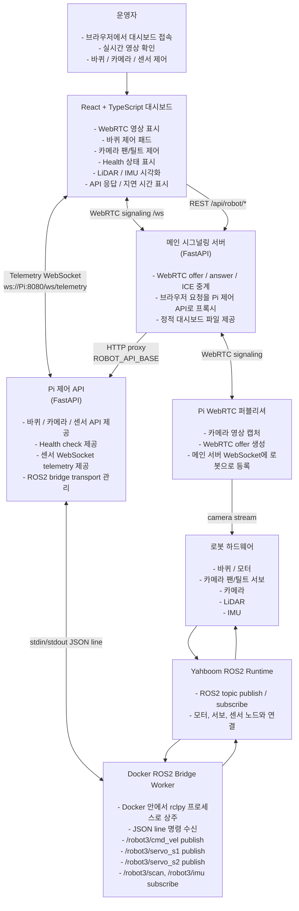

# 로봇 웹 제어 대시보드

브라우저에서 실시간 카메라 영상을 보면서 로봇 바퀴, 카메라 팬/틸트, LiDAR, IMU 상태를 함께 확인하고 제어하는 로봇 웹 대시보드 프로젝트입니다.

## 데모 영상

- [YouTube 데모 영상 보기](https://youtu.be/11gIdRGt-ws)


- [blog](https://blog.naver.com/leepl37)

## 주요 기능

- React + TypeScript 대시보드
- WebRTC 실시간 카메라 영상
- 바퀴 / 카메라 팬틸트 제어
- LiDAR / IMU 센서 확인
- FastAPI 기반 메인 서버와 파이 제어 서버
- Docker ROS2 bridge를 통한 로봇 제어

## 프로젝트 구성

```text
robot-web-control/
  main_signaling_server/   # 메인 서버: 대시보드 제공, WebRTC 시그널링, Pi API 프록시
  pi_control_api/          # 파이 제어 서버: 바퀴, 카메라, LiDAR, IMU API
  pi_webrtc_publisher/     # 파이 카메라 WebRTC 퍼블리셔
  docs/                    # 아키텍처와 설계 문서
```

### main_signaling_server

브라우저가 접속하는 메인 서버입니다.

- React 대시보드 정적 파일 제공
- WebRTC `offer / answer / ICE` 시그널링 중계
- `/api/robot/*` 요청을 Pi 제어 서버로 프록시

### pi_control_api

라즈베리파이에서 실행되는 로봇 제어 API 서버입니다.

- 바퀴 제어: `/motors/*`
- 카메라 팬/틸트 제어: `/ptz/*`
- 센서 조회: `/sensors/*`
- 센서 실시간 데이터: `/ws/telemetry`
- Docker 내부 ROS2 bridge worker 관리

### pi_webrtc_publisher

파이 카메라 영상을 WebRTC로 송출하는 퍼블리셔입니다.

- 카메라 프레임 캡처
- 메인 서버에 로봇으로 등록
- 브라우저 대시보드와 WebRTC 연결

## 시스템 아키텍처

자세한 설명은 [`docs/architecture.md`](docs/architecture.md)를 참고하세요.



## 기술 스택

- 프론트엔드: TypeScript
- 백엔드: FastAPI, WebSocket
- 영상: WebRTC
- 로봇 연동: ROS2, rclpy, Docker
- 하드웨어: Raspberry Pi, Yahboom robot, Camera, LiDAR, IMU

## 문제 해결 포인트

### 1. Docker CLI 제어 지연

초기에는 요청마다 `docker exec + ros2 topic pub` 명령을 실행했습니다.  
이 방식은 동작은 확실했지만, 매 요청마다 Docker 프로세스와 ROS CLI 초기화 비용이 발생했습니다.

이를 개선하기 위해 Docker 내부에 `rclpy` bridge worker를 상주시켰습니다.  
이후 API 서버는 JSON 한 줄만 보내고, bridge worker가 즉시 ROS topic을 publish합니다.

### 2. 카메라 서보 매핑

실제 테스트를 통해 아래와 같이 매핑을 확정했습니다.

- `/robot3/servo_s1`: 좌우, pan
- `/robot3/servo_s2`: 상하, tilt

### 3. Mock / 실제 하드웨어 설정 분리

`/health` 응답으로 현재 서버가 mock인지 실제 Yahboom ROS2 backend에 연결되었는지 확인할 수 있게 했습니다.

### 4. 프록시 경로 정리

메인 서버는 `/api/robot/*` 요청을 Pi 제어 API로 전달합니다.  
브라우저 UI에서 자주 쓰는 `/motors/*` 경로도 프록시 별칭으로 지원했습니다.

## 실행 요약

### Pi 제어 API

```bash
cd pi_control_api
./run_control.sh
```

### 메인 서버

```bash
cd main_signaling_server
export ROBOT_API_BASE=http://<Pi-IP>:8080
./run_server.sh restart
```

### 대시보드

```text
http://<Main-Server-IP>:8000/
```
