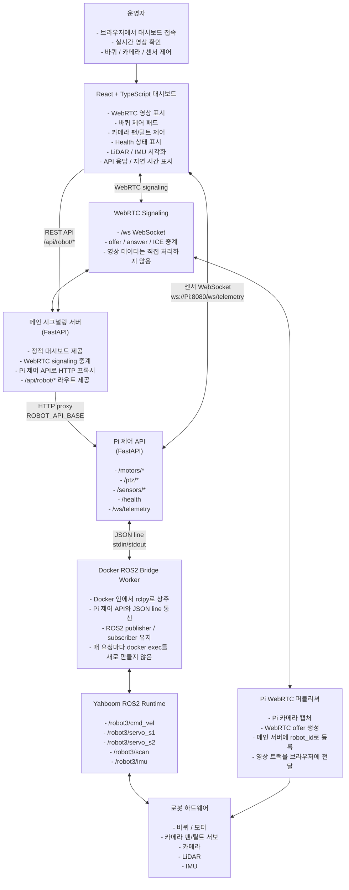
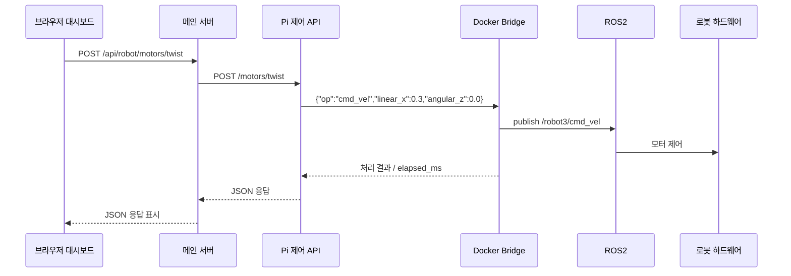
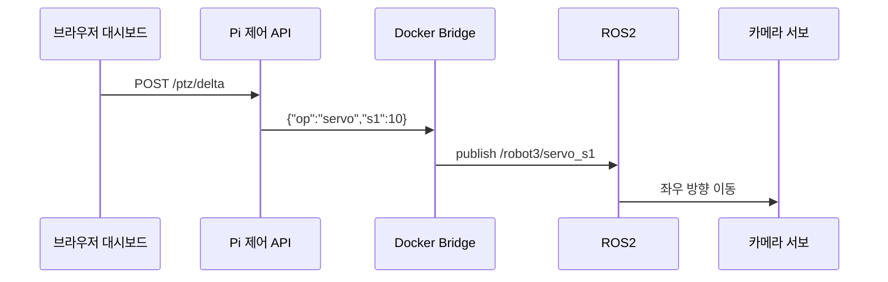

# 시스템 아키텍처

이 문서는 현재 구현된 로봇 웹 제어 시스템의 실제 구조를 설명합니다.  
초기 설계에 있던 데이터베이스, 파일 저장소, Rust edge agent, MCU 직접 제어 계층은 이번 버전에서는 제외하고, 현재 동작하는 서버와 통신 흐름 중심으로 정리했습니다.

## 전체 구조



## 서버별 역할

### 1. React + TypeScript 대시보드

브라우저에서 로봇을 제어하는 화면입니다.

- WebRTC 카메라 영상 표시
- 바퀴 방향 제어
- 카메라 팬/틸트 제어
- Health 상태 표시
- LiDAR / IMU 데이터 확인
- API 응답과 지연 시간 확인

### 2. 메인 시그널링 서버

`main_signaling_server`는 브라우저와 Pi 쪽 프로세스를 연결합니다.

- `/ws`: WebRTC signaling WebSocket
- `/api/robot/*`: Pi 제어 API로 HTTP 프록시
- `/static/dashboard/index.html`: 대시보드 정적 파일 제공

중요한 점은 메인 서버가 직접 ROS2를 다루지 않는다는 것입니다.  
로봇 제어 명령은 HTTP로 Pi 제어 API에 전달됩니다.

### 3. Pi WebRTC 퍼블리셔

Pi에서 카메라 영상을 캡처하고 WebRTC offer를 생성합니다.  
메인 서버의 `/ws`에 로봇 역할로 등록하고, 브라우저가 접속하면 WebRTC 연결을 맺습니다.

### 4. Pi 제어 API

`pi_control_api`는 실제 로봇 제어의 입구입니다.

- `/motors/twist`: 바퀴 속도 명령
- `/motors/stop`: 정지 명령
- `/ptz/delta`: 카메라 상대 이동
- `/ptz/absolute`: 카메라 절대 각도 이동
- `/sensors/imu`: IMU 조회
- `/sensors/lidar/scan`: LiDAR 조회
- `/ws/telemetry`: 센서 WebSocket telemetry

### 5. Docker ROS2 Bridge Worker

처음에는 매 요청마다 아래 방식으로 ROS2 명령을 실행했습니다.

```bash
docker exec ...
source /opt/ros/humble/setup.bash
source /root/yahboomcar_ws/install/setup.bash
ros2 topic pub ...
```

이 방식은 검증은 쉬웠지만 지연이 컸습니다.  
현재는 Docker 안에 Python `rclpy` worker를 한 번 띄워두고, Pi 제어 API가 JSON line으로 명령을 전달합니다.

예:

```json
{"op":"cmd_vel","linear_x":0.3,"angular_z":0.0}
```

```json
{"op":"servo","s1":10}
```

브릿지가 이 명령을 받아 ROS2 topic에 바로 publish합니다.

## 주요 ROS2 토픽

| 기능 | Topic | Message |
|---|---|---|
| 바퀴 속도 | `/robot3/cmd_vel` | `geometry_msgs/msg/Twist` |
| 카메라 좌우 | `/robot3/servo_s1` | `std_msgs/msg/Int32` |
| 카메라 상하 | `/robot3/servo_s2` | `std_msgs/msg/Int32` |
| LiDAR | `/robot3/scan` | `sensor_msgs/msg/LaserScan` |
| IMU | `/robot3/imu` | `sensor_msgs/msg/Imu` |

## 통신 흐름 예시

### 바퀴 전진



### 카메라 팬/틸트



## 포트폴리오에서 강조할 점

- WebRTC 실시간 영상과 로봇 제어 API를 하나의 대시보드로 통합
- FastAPI 메인 서버와 Pi 제어 API를 분리한 구조
- Docker 안 ROS2 환경을 유지하면서 지연을 줄이기 위해 bridge worker 도입
- LiDAR / IMU sensor telemetry를 WebSocket으로 실시간 표시
- 하드웨어 mock / real 설정을 `/health`에서 확인 가능하게 구성
